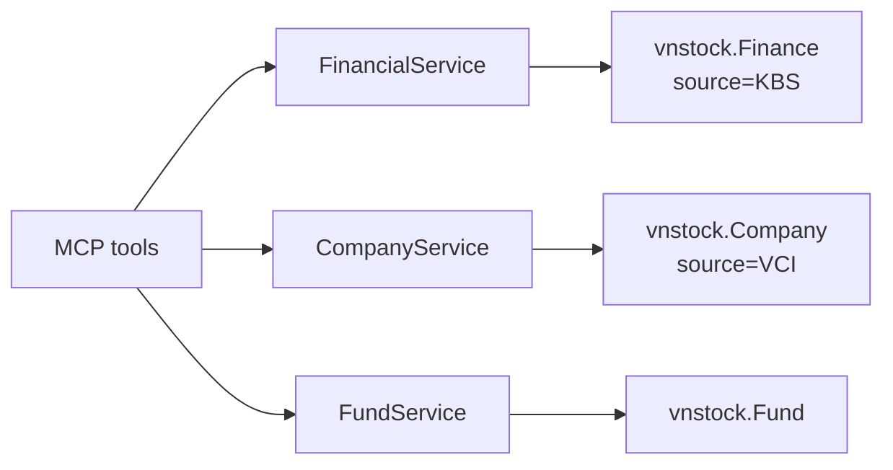

# Changelog

All notable changes to this project will be documented in this file.

The format is based on [Keep a Changelog](https://keepachangelog.com/en/1.0.0/),
and this project adheres to [Semantic Versioning](https://semver.org/spec/v2.0.0.html).

## [Unreleased]

### Changed
- **vnstock 4.x migration** - Updated the data layer from vnstock 3.x explorer imports to vnstock 4.x top-level adapters.
  - Financial tools now use `Finance(source="KBS")` for consistent statement and ratio output.
  - Financial tools no longer expose `lang` because vnstock 4.x KBS financial calls ignore language parameters; use `item_id` for stable metric identification.
  - Company tools now use `Company(source="VCI")` to keep `ratio_summary` and `trading_stats` support.
  - Fund tools now use the top-level `Fund` adapter.
  - Financial statement and ratio JSON now follows vnstock 4.x metric-row shape: `item`, `item_id`, then period columns such as `2025`, `2024`, `2023`, `2022`.
- **Dependency updates** - Updated `vnstock>=3.3.0` to `vnstock>=4.0.2,<5`, refreshed `uv.lock`, and regenerated `requirements.txt`.
- **Tooling configuration** - Added `vulture` to the dev dependency group and configured `[tool.vulture]` in `pyproject.toml`.

### Removed
- **`reports` company info type** - Removed because vnstock 4.0.2 no longer exposes a working `Company.reports()` method through VCI or KBS.

### Scope of Impact
- **Modified files**:
  - `src/vnstock_mcp/core/financial.py`
    - `get_income_statement()` - top-level `Finance`, KBS source, removed `lang`, vnstock 4.x period-column ordering
    - `get_balance_sheet()` - top-level `Finance`, KBS source, removed `lang`, vnstock 4.x period-column ordering
    - `get_cash_flow()` - top-level `Finance`, KBS source, removed `lang`, vnstock 4.x period-column ordering
    - `get_financial_ratios()` - top-level `Finance`, KBS source, removed `lang`, removed MultiIndex flattening
  - `src/vnstock_mcp/core/company.py`
    - `get_company_info()` - top-level `Company`, VCI source
    - `_fetch_by_info_type()` - removed `reports` dispatch
  - `src/vnstock_mcp/core/fund.py`
    - `get_fund_listing()` - top-level `Fund`
    - `search_funds()` - top-level `Fund`
    - `get_fund_nav_report()` - top-level `Fund`
    - `get_fund_top_holdings()` - top-level `Fund`
    - `get_fund_industry_allocation()` - top-level `Fund`
    - `get_fund_asset_allocation()` - top-level `Fund`
  - `src/vnstock_mcp/config.py`
    - `VALID_INFO_TYPES` - removed `reports`
  - `src/vnstock_mcp/server.py`
    - Financial tool signatures - removed `lang`
    - `get_company_info()` docstring - removed `reports`
  - `src/vnstock_mcp/utils/data_transform.py`
    - `sort_financial_period_columns()` - added helper for vnstock 4.x period columns
    - `flatten_dataframe()` - removed unused vnstock 3.x MultiIndex helper
  - `tests/unit/test_financial_service.py`, `tests/unit/test_company_service.py`, `tests/unit/test_fund_service.py`
    - Updated unit tests for top-level adapters, source selection, financial shape, and `reports` removal
- **Documentation updated**: `README.md`, `llms.txt`, `docs/ARCHITECTURE.md`, `CHANGELOG.md`

### Added
- **Docker MCP Gateway Integration** - Containerized deployment with Docker MCP Gateway support
  - `Dockerfile` - Multi-stage build with Python 3.12-slim, non-root user, health check
  - `docker-compose.yml` - Standalone container deployment (HTTP mode on port 8001)
  - `docker-compose.gateway.yml` - Docker MCP Gateway orchestration (port 8811)
  - `docker/vnstock.yaml` - Gateway server entry with tool definitions and network allowlist
  - `docker/registry.yaml` - Gateway registry configuration
  - `docker/config.yaml` - Gateway server enablement
  - `render-gateway.yaml` - Render.com Docker-based deployment blueprint
  - `.dockerignore` - Excludes unnecessary files from Docker context
  - `requirements.txt` - Exported from pyproject.toml for Docker pip install

### Technical Details
- **New files**: `Dockerfile`, `.dockerignore`, `docker-compose.yml`, `docker-compose.gateway.yml`, `render-gateway.yaml`, `requirements.txt`, `docker/vnstock.yaml`, `docker/registry.yaml`, `docker/config.yaml`
- **Modified files**: `README.md` (Docker usage section), `CLAUDE.md` (Docker dev commands), `CHANGELOG.md`
- **Transport**: No PORT env = STDIO (gateway on-demand), PORT set = HTTP (standalone/Render)
- **Existing deployment**: `render.yaml` (native Python) remains unchanged

## [0.3.0] - 2026-03-09

### Changed
- **Layered Architecture Refactoring** - Major restructure to clean architecture
  - **Service Layer** (`src/vnstock_mcp/core/`): Business logic separated from API layer
  - **Model Layer** (`src/vnstock_mcp/models/`): Typed Result objects for consistent error handling
  - **Thin API Layer**: `server.py` reduced to 11 tool definitions with minimal logic

### Added
- **Architecture Documentation** (`docs/architecture/`)
  - System overview with Mermaid diagrams
  - Data flow and component interaction diagrams
  - Deployment architecture documentation
- **Architecture Decision Records** (`docs/adr/`)
  - ADR-001: Layered Architecture
  - ADR-002: Result Pattern for Error Handling
  - ADR-003: Lazy Loading Strategy

### Technical Details
- **New directories**: `src/vnstock_mcp/core/`, `src/vnstock_mcp/models/`
- **Modified files**: `src/vnstock_mcp/server.py` (reduced from ~600 to ~200 lines)
- **Pattern**: Each tool now delegates to service functions that return typed `Result` objects
- **Error handling**: Consistent error messages via `Result.success()` and `Result.failure()`

## [0.2.0] - 2026-03-09

### Added
- **Dual transport support** - Auto-detects deployment environment via `PORT` env var
  - `PORT` set (e.g., Render): HTTP transport on `0.0.0.0:PORT`
  - `PORT` unset (local): STDIO transport for `uvx` / Claude Desktop
- **Render deployment** - Added `render.yaml` for one-click Render.com deployment (free tier, Singapore region)
- **Remote proxy** - Added `proxy_server.py` to bridge Claude Desktop (STDIO) to a remote HTTP server

### Removed
- **`pyportfolioopt` dependency** - Removed unused portfolio optimization dependency
- **`anthropic` dependency** - Removed unused dependency (MCP server does not call Anthropic API)
- **`requirements.txt`** - Superseded by `uv.lock`
- **`server_backup.py`** - Stale backup file

### Changed
- **Version bump** - `0.1.5` → `0.2.0`
- **FastMCP init** - Now configures `host` and `port` in constructor for HTTP readiness
- **`main()` function** - Branches on transport based on `PORT` environment variable

### Technical Details
- **Modified files**: `src/vnstock_mcp/server.py` (~10 lines), `pyproject.toml`, `src/vnstock_mcp/__init__.py`
- **New files**: `render.yaml`, `proxy_server.py`
- **Deleted files**: `requirements.txt`, `server_backup.py`, `src/vnstock_mcp/.gitignore`
- **Functions modified**: `main()` (transport selection), module-level init (env detection)
- **No tool changes** - All 18 MCP tools remain identical

## [0.1.5] - 2025-03-09

### Changed
- **Dependency updates** - Updated `vnstock==3.2.2` to `vnstock>=3.3.0`
- **Removed vnai dependency** - The `vnai==2.1.9` dependency is no longer needed with vnstock 3.3.0+
- **Added pytz>=2025.2** - Required for timezone handling

### Removed
- **`get_dividend_history` tool** - Removed the TCBS-based dividend history feature. This tool was dependent on the vnai package which is no longer required.

### Fixed
- **Hardcoded source parameter in Finance and Company classes** - Removed hardcoded `source="VCI"` parameter from Finance and Company class instantiations. The `source` parameter is not valid for explorer-level classes (`vnstock.explorer.vci.Finance` and `vnstock.explorer.vci.Company`), which are already VCI-specific by their module path. This fix prevents potential initialization errors and aligns with the vnstock library's API design.
  - **Affected functions**:
    - `get_income_statement()` - Finance initialization (line 221)
    - `get_balance_sheet()` - Finance initialization (line 261)
    - `get_cash_flow()` - Finance initialization (line 301)
    - `get_financial_ratios()` - Finance initialization (line 342)
    - `get_company_info()` - Company initialization (line 527)
  - **Impact**: All 5 functions now correctly instantiate Finance/Company classes without invalid parameters
  - **Scope**: Bug fix, no breaking changes to tool behavior or API

- **Circular import error with vnai dependency** - Implemented lazy imports for all vnstock modules to avoid circular dependency. All imports from `vnstock.explorer.*` are now moved inside function bodies instead of module-level. This resolves the `AttributeError: partially initialized module 'vnai' has no attribute 'setup'` error when running via uvx.
  - **Root cause**: Any import from `vnstock.*` (even explorer-level) triggers `vnstock/__init__.py` execution, which imports vnai and calls `vnai.setup()`, creating a circular dependency before vnai is fully initialized.
  - **Solution**: Lazy imports - all vnstock imports are deferred until function execution, avoiding module-level initialization.

### Changed
- **Lazy imports for all vnstock modules** - Moved ALL vnstock imports from module-level to function-level across all 20 MCP tools:
  - Market Data tools (4): `Quote` from vci, `MSNQuote` from msn
  - Financial Analysis tools (4): `Finance` from vci, `flatten_hierarchical_index` from core.utils
  - Company Information tools (2): `Company` from vci, `TCBSCompany` from tcbs
  - Precious Metals tools (2): `sjc_gold_price`, `btmc_goldprice` from misc.gold_price
  - Exchange Rate tool (1): `vcb_exchange_rate` from misc.exchange_rate
  - Fund Management tools (6): `Fund` from fmarket.fund
- **Quote class initialization fix** - Removed invalid `source` parameter from explorer-level Quote instantiation (explorer classes don't accept source parameter)
- **Removed module-level Fund() initialization** - Eliminated eager API call at server startup by moving `Fund()` instantiation inside each fund function

### Technical Details
- **Affected files**: `src/vnstock_mcp/server.py`
- **Functions modified**: All 20 MCP tools
- **Import pattern**: Lazy imports inside try blocks with comment `# Lazy import to avoid circular dependency`
- **Performance impact**: Minimal - first call to each function slightly slower, subsequent calls use cached imports
- **Compatibility**: No breaking changes to tool signatures or behavior

## [0.1.0] - 2024-11-06

### Added
- Initial release with 20 MCP tools across 6 categories:
  - Market Data Tools (4): Stock, forex, crypto, and index historical data
  - Financial Analysis Tools (4): Income statements, balance sheets, cash flows, financial ratios
  - Company Information Tools (2): Dividend history, company info (8 sub-types)
  - Precious Metals Tools (2): SJC and BTMC gold prices
  - Exchange Rate Tools (1): VCB exchange rates
  - Fund Management Tools (5): Fund listings, NAV reports, holdings, allocations
- FastMCP 2.0 integration for Claude Desktop
- Async architecture with proper event loop management
- Support for multiple data sources (VCI, MSN, TCBS, direct APIs)

[Unreleased]: https://github.com/gahoccode/vnstock-mcp/compare/v0.3.0...HEAD
[0.3.0]: https://github.com/gahoccode/vnstock-mcp/compare/v0.2.0...v0.3.0
[0.2.0]: https://github.com/gahoccode/vnstock-mcp/compare/v0.1.5...v0.2.0
[0.1.5]: https://github.com/gahoccode/vnstock-mcp/compare/v0.1.0...v0.1.5
[0.1.0]: https://github.com/gahoccode/vnstock-mcp/releases/tag/v0.1.0
