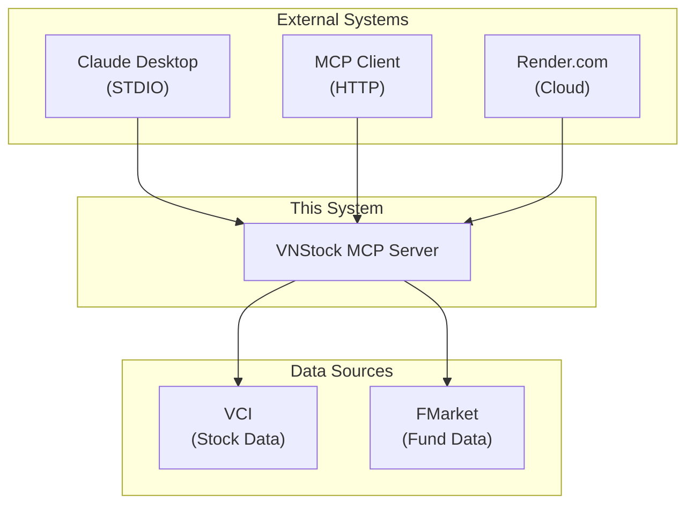
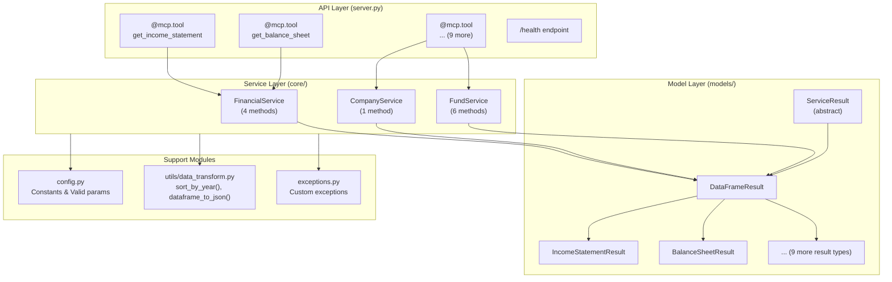
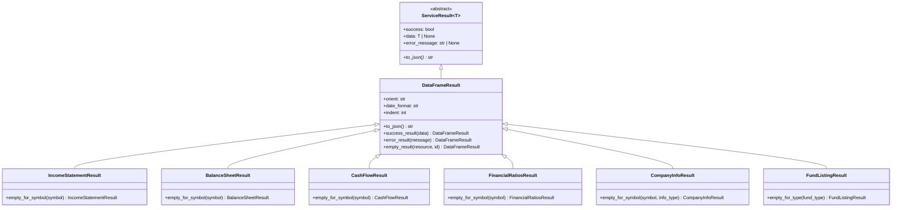
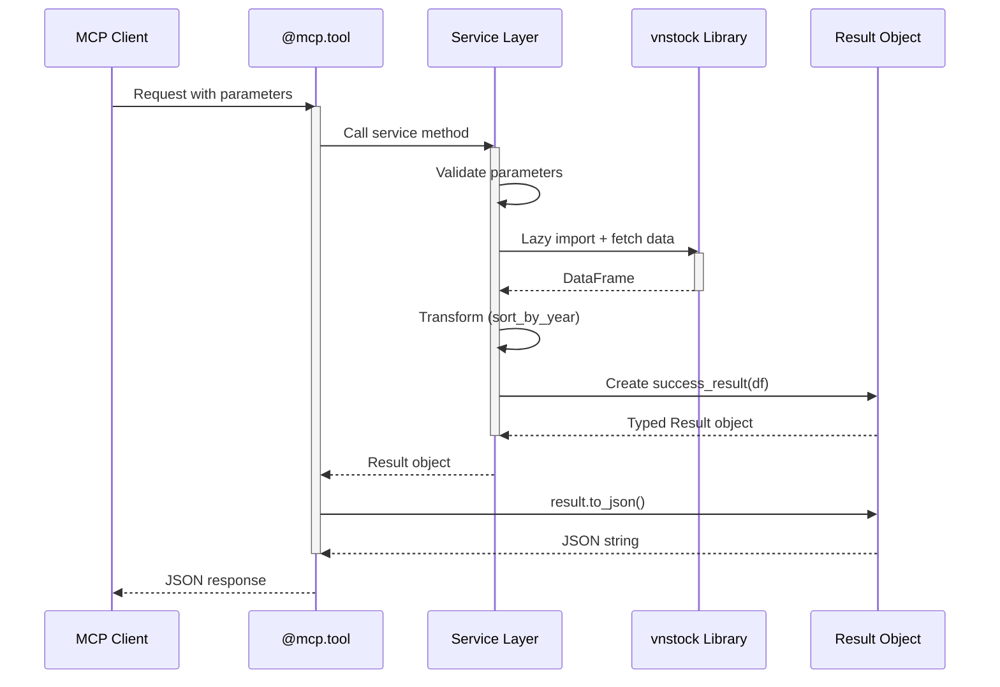
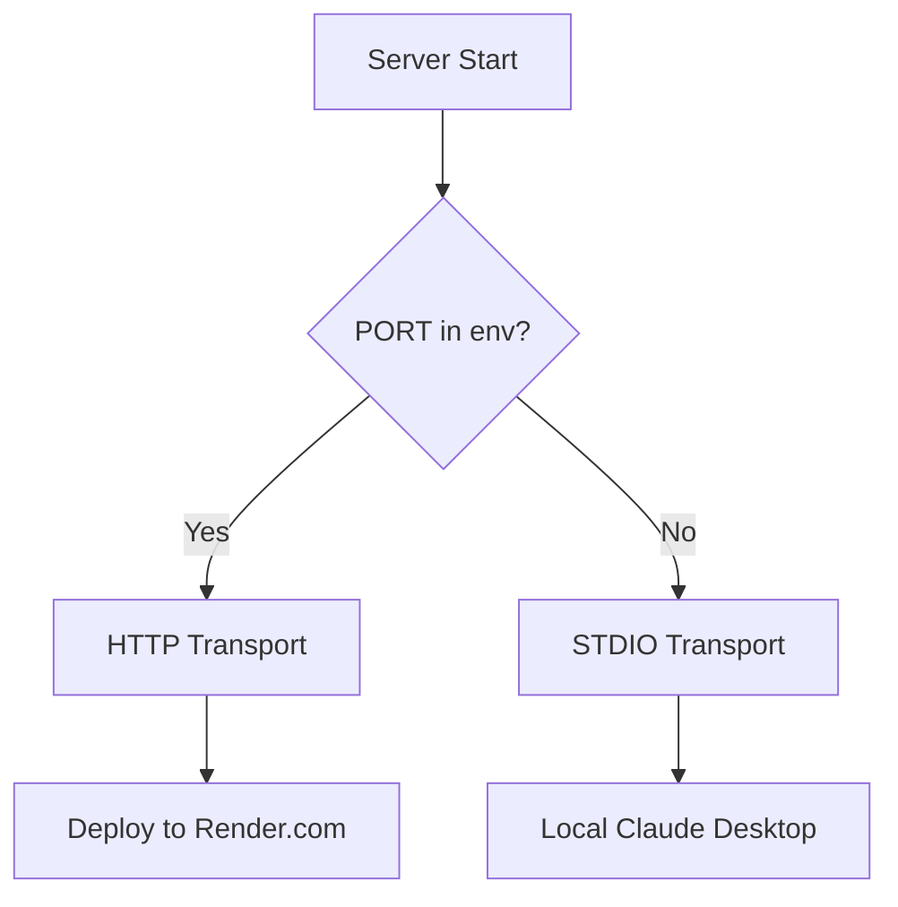

# Architecture Overview

This document describes the architecture of the VNStock MCP Server, a Python-based Model Context Protocol (MCP) server that provides Vietnamese stock market financial data.

## Table of Contents

- [System Context](#system-context)
- [Container Architecture](#container-architecture)
- [Component Details](#component-details)
- [Data Flow](#data-flow)
- [Deployment Architecture](#deployment-architecture)
- [Key Architectural Patterns](#key-architectural-patterns)

---

## System Context



The VNStock MCP Server sits between MCP clients (like Claude Desktop) and Vietnamese financial data sources (VCI and FMarket).

---

## Container Architecture



---

## Component Details

### 1. API Layer (`server.py`)

**Purpose**: Thin MCP API layer with FastMCP decorators.

**Responsibilities**:
- Register 11 MCP tools with `@mcp.tool()` decorator
- Handle `/health` endpoint for cloud deployment
- Delegate business logic to services
- Convert `Result` objects to JSON strings

**Tools by Domain**:

| Domain | Tool | Service Method |
|--------|------|----------------|
| Financial | `get_income_statement` | `FinancialService.get_income_statement()` |
| Financial | `get_balance_sheet` | `FinancialService.get_balance_sheet()` |
| Financial | `get_cash_flow` | `FinancialService.get_cash_flow()` |
| Financial | `get_financial_ratios` | `FinancialService.get_financial_ratios()` |
| Company | `get_company_info` | `CompanyService.get_company_info()` |
| Fund | `get_fund_listing` | `FundService.get_fund_listing()` |
| Fund | `search_funds` | `FundService.search_funds()` |
| Fund | `get_fund_nav_report` | `FundService.get_fund_nav_report()` |
| Fund | `get_fund_top_holdings` | `FundService.get_fund_top_holdings()` |
| Fund | `get_fund_industry_allocation` | `FundService.get_fund_industry_allocation()` |
| Fund | `get_fund_asset_allocation` | `FundService.get_fund_asset_allocation()` |

### 2. Service Layer (`core/`)

**Base Service** (`core/base.py`):
- `BaseService` class with async execution patterns
- `run_sync()` method wraps synchronous vnstock calls in executor

**Financial Service** (`core/financial.py`):
- 4 methods for financial statements
- Uses `vnstock.explorer.vci.Finance` class
- Applies `sort_by_year()` transformation

**Company Service** (`core/company.py`):
- 1 method with 9 info types
- Uses `vnstock.explorer.vci.Company` class
- Validates `info_type` against `VALID_INFO_TYPES`

**Fund Service** (`core/fund.py`):
- 6 methods for fund data
- Uses `vnstock.explorer.fmarket.fund.Fund` class
- Validates `fund_type` against `VALID_FUND_TYPES`

### 3. Model Layer (`models/`)

**Result Object Pattern**:



**Benefits**:
- Type-safe responses
- Consistent error handling
- Testable without MCP context
- Clear success/failure semantics

### 4. Configuration (`config.py`)

| Constant | Value | Purpose |
|----------|-------|---------|
| `SERVICE_NAME` | `"vnstock"` | MCP server name |
| `VERSION` | `"0.2.0"` | Server version |
| `PORT` | env `PORT` or 8001 | HTTP port |
| `USE_HTTP` | `PORT in os.environ` | Transport mode |
| `VALID_LANGUAGES` | `{"en", "vi"}` | Valid language codes |
| `VALID_INFO_TYPES` | 9 types | Valid company info types |
| `VALID_FUND_TYPES` | `{"", "BALANCED", "BOND", "STOCK"}` | Valid fund types |

---

## Data Flow



---

## Deployment Architecture

### Transport Modes

| Mode | Trigger | Use Case | Command |
|------|---------|----------|---------|
| STDIO | No `PORT` env var | Local (Claude Desktop, uvx) | `mcp.run()` |
| HTTP | `PORT` env var set | Cloud (Render.com) | `mcp.run(transport="streamable-http", ...)` |

### Cloud Deployment (Render.com)

```yaml
services:
  - type: web
    name: vnstock-mcp-server
    runtime: python
    plan: free
    buildCommand: "uv sync"
    startCommand: "uv run python src/vnstock_mcp/server.py"
    healthCheckPath: /health
    envVars:
      - key: PORT
        value: 8001
```

### Transport Mode Detection



---

## Key Architectural Patterns

### 1. Lazy Import Pattern

Imports from vnstock are done inside service methods, not at module level, to avoid circular dependencies.

```python
# Inside service methods (not module level)
async def get_income_statement(self, symbol: str):
    from vnstock.explorer.vci import Finance  # Lazy import
    # ...
```

**Rationale**: See [ADR-003](adr/003-lazy-imports.md)

### 2. Async Executor Pattern

Synchronous vnstock operations are wrapped in async executors to prevent blocking.

```python
class BaseService:
    async def run_sync(self, func: Callable[..., T]) -> T:
        loop = asyncio.get_event_loop()
        return await loop.run_in_executor(None, func)
```

### 3. Result Object Pattern

Services return typed Result objects instead of raw data or exceptions.

```python
# Service returns typed Result
result = await financial_service.get_income_statement("VCI")

# API layer converts to JSON
return result.to_json()
```

**Rationale**: See [ADR-002](adr/002-result-objects.md)

### 4. Layered Architecture

The codebase is organized into three distinct layers:
- **API Layer**: MCP tool definitions, thin delegation
- **Service Layer**: Business logic, data fetching, validation
- **Model Layer**: Data structures, result types

**Rationale**: See [ADR-001](adr/001-layered-architecture.md)

---

## Related Documentation

- [ADR-001: Layered Architecture](adr/001-layered-architecture.md)
- [ADR-002: Result Objects](adr/002-result-objects.md)
- [ADR-003: Lazy Imports](adr/003-lazy-imports.md)