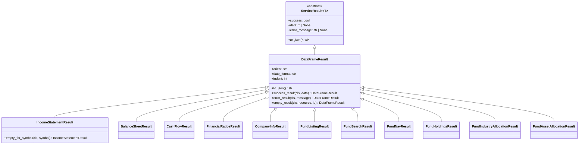

# ADR-002: Result Object Pattern

## Status

Accepted

## Context

MCP tools must return strings (typically JSON) to the client. The original implementation directly returned JSON strings from service methods, which made error handling inconsistent and testing difficult.

```python
# Original approach
def get_income_statement(symbol: str) -> str:
    try:
        df = fetch_data(symbol)
        return df.to_json()
    except Exception as e:
        return f"Error: {e}"  # Inconsistent error format
```

## Decision

We implemented a Result Object pattern where services return typed objects that encapsulate success/failure state and data, with a `to_json()` method for serialization.

```python
# New approach
class ServiceResult(ABC, Generic[T]):
    success: bool
    data: T | None
    error_message: str | None

    @abstractmethod
    def to_json(self) -> str: ...

class DataFrameResult(ServiceResult[pd.DataFrame]):
    def to_json(self) -> str:
        if not self.success:
            return self.error_message
        return self.data.to_json(orient="records")

# Usage in service
async def get_income_statement(self, symbol: str) -> IncomeStatementResult:
    try:
        df = await self.run_sync(lambda: finance.income_statement())
        return IncomeStatementResult.success_result(df)
    except Exception as e:
        return IncomeStatementResult.error_result(f"Error: {e}")
```

## Rationale

### Type Safety

Each result type is specific to its domain:

```python
IncomeStatementResult   # For income statements
BalanceSheetResult      # For balance sheets
FundListingResult       # For fund listings
```

This makes the contract clear and enables IDE autocompletion.

### Consistent Error Handling

All errors follow the same pattern:

```python
return Result.error_result("Descriptive error message")
return Result.empty_for_symbol("VCI")
```

### Testability

Results can be inspected without JSON parsing:

```python
result = await service.get_income_statement("VCI")
assert result.success
assert result.data is not None
assert len(result.data) > 0
```

### Separation of Concerns

- Services handle business logic and create results
- Models handle serialization logic
- API layer just calls `to_json()`

## Consequences

### Positive

- **Type Safety**: IDE support and type checking
- **Consistency**: All errors follow the same format
- **Testability**: Results can be inspected directly
- **Extensibility**: New result types can be added easily

### Negative

- **Boilerplate**: Each result type needs a class definition
- **Indirection**: One more abstraction layer
- **Learning Curve**: Developers need to understand the pattern

## Class Hierarchy



## Alternatives Considered

### 1. Return Tuples

```python
return (True, df, None)  # (success, data, error)
```

Less readable and no type safety for the data.

### 2. Raise Exceptions

```python
try:
    df = await service.get_income_statement("VCI")
    return df.to_json()
except DataNotFoundError:
    return "No data found"
except Exception as e:
    return f"Error: {e}"
```

Pushes error handling to the API layer and makes testing harder.

### 3. Return Dicts

```python
return {"success": True, "data": df, "error": None}
```

No type safety and no serialization logic encapsulation.

## References

- [Result Pattern in Rust](https://doc.rust-lang.org/std/result/)
- [Functional Error Handling in Python](https://medium.com/@dtinth/functional-error-handling-in-python-with-result-type-4c4b3c2b0f0a)